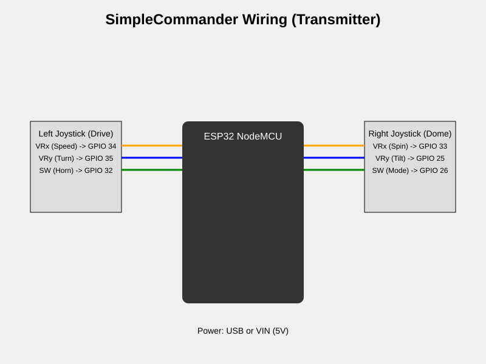

# SimpleCommander Wiring

## Pinout Configuration

| Component | Pin Name | ESP32 GPIO | Description |
|-----------|----------|------------|-------------|
| **Left Stick** | VRx | 34 | Forward/Reverse Speed |
| | VRy | 35 | Left/Right Turn |
| | SW | 32 | Horn / Action 1 |
| **Right Stick** | VRx | 33 | Dome Spin |
| | VRy | 25 | Dome Tilt (Future) |
| | SW | 26 | Mode Select |

## Diagram

