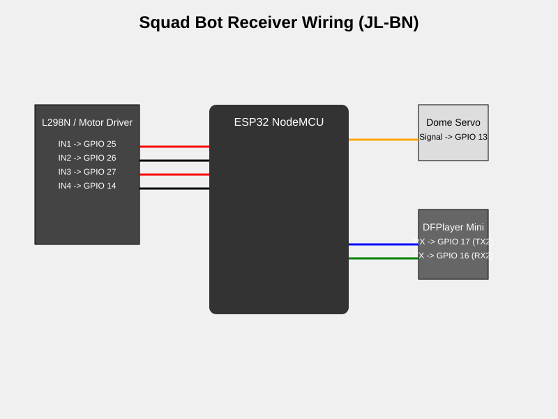

# Squad Bot Receiver Wiring (JL-BN)

## Pinout Configuration

| Component | Pin Name | ESP32 GPIO | Description |
|-----------|----------|------------|-------------|
| **Left Motor** | IN1 | 25 | Motor A Forward |
| | IN2 | 26 | Motor A Reverse |
| **Right Motor** | IN3 | 27 | Motor B Forward |
| | IN4 | 14 | Motor B Reverse |
| **Dome** | Signal | 13 | Continuous Rotation Servo |
| **Audio** | RX | 17 | DFPlayer RX (Connect to ESP TX2) |
| | TX | 16 | DFPlayer TX (Connect to ESP RX2) |

## Diagram

